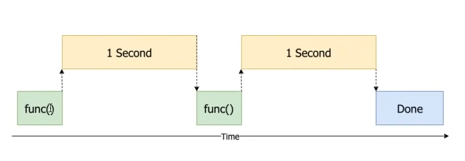
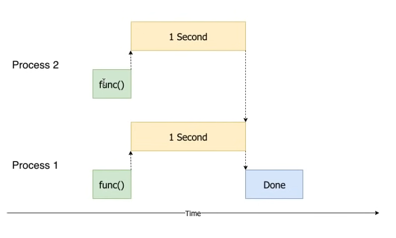

# multiprocessing

Multiprocessing, iki veya daha fazla işlemcinin bir araya getirilerek, işlenmesi gereken buyruğun daha hızlı bir şekilde işlenmesini sağlamaya yönelik bir tasarımdır. Çoklu işlemcilerin tek başına bir işlemciden daha hızlı olması beklenir.

İşlemci bağımlı işlemlerin paralel olarak çalıştırılması için kullanılır.

Aşağıda tek process ve çoklu process arasındaki fark görülmektedir. Her bir process farklı bir işlemci çekirdeği yardımıyla yürütülür ve bu şekilde paralel çalışma sağlanır. Ancak bu paralel çalışmanın da bir sınırı vardır. Bilgisayarınızdaki işlemci çekirdeği sayısına ulaştıktan sonra daha fazla process oluşturursanız senkron çalışmaya geçiş başlar. Bu sebeple process sayısı iyi belirlenmelidir.


**Thread kullanımına göre daha maliyetli olduğu için sadece gerçekten ihtiyaç olan yerlerde kullanılmalıdır.**






### Basit Process Oluşturma



```python
import multiprocessing
import time

start = time.perf_counter()


def do_something(seconds):
    print(f"Sleeping {seconds} second(s)...")
    time.sleep(seconds)
    print("Done sleeping...")


processes = list()

for _ in range(10):
    p = multiprocessing.Process(target=do_something, args=[1.5])
    p.start()
    processes.append(p)

for process in processes:
    process.join()


finish = time.perf_counter()

print(f"Finished in {round(finish - start,4)} second(s)")
```



Sleeping 1.5 second(s)... 

Sleeping 1.5 second(s)... 

Sleeping 1.5 second(s)... 

Sleeping 1.5 second(s)... 

Sleeping 1.5 second(s)... 

Sleeping 1.5 second(s)... 

Sleeping 1.5 second(s)... 

Sleeping 1.5 second(s)... 

Sleeping 1.5 second(s)... 

Sleeping 1.5 second(s)... 

Done sleeping... 

Done sleeping... 

Done sleeping... 

Done sleeping... 

Done sleeping... 

Done sleeping... 

Done sleeping... 

Done sleeping... 

Done sleeping... 

Done sleeping... 

Finished in 1.5206 second(s)



Yukarıdaki kodda 10 adet process oluşturulmuş ve her bir processe 1.5 saniye bekleme işi verilmiştir. İşlemci çekirdeği sayısına göre değişmekle beraber 12 çekirdekli işlemcide çalıştırıldığında, çıktı sekmesinde verilen sürede işlem tamamlanmıştır.

### Process Havuzu

Aşağıda process havuzunun kullanımı verilmiştir. 13. satırda havuz oluşturulmuştur. 15. satırda ise her processe list comprehension yöntemiyle submit olunmuştur. max_workers=5 ile aynı anda kaç işlemci çekirdeği kullanılacağını belirtiyoruz.

16\. satırda as_completed fonksiyonu ise her bir process çalıştığında yapılacak işlem için callback eklememizi sağlar.



```python
import concurrent.futures
import time

start = time.perf_counter()


def do_something(seconds):
    print(f"Sleeping {seconds} second(s)...")
    time.sleep(seconds)
    return f"Done sleeping...{seconds}"


with concurrent.futures.ProcessPoolExecutor(max_workers=5) as executor:
    secs = [5, 4, 3, 2, 1]
    futures = [executor.submit(do_something, sec) for sec in secs]
    for f in concurrent.futures.as_completed(futures):
        print(f.result())
        
        
finish = time.perf_counter()

print(f"Finished in {round(finish - start,4)} second(s)")

```



Sleeping 5 second(s)... 

Sleeping 4 second(s)... 

Sleeping 3 second(s)... 

Sleeping 2 second(s)... 

Sleeping 1 second(s)... 

Done sleeping...1 

Done sleeping...2 

Done sleeping...3 

Done sleeping...4 

Done sleeping...5 

Finished in 5.0467 second(s)



```python
import concurrent.futures
import multiprocessing
import time

start = time.perf_counter()


def do_something(seconds):
    print(f"Sleeping {seconds} second(s)...")
    time.sleep(seconds)
    return f"Done sleeping...{seconds}"


with concurrent.futures.ProcessPoolExecutor(max_workers=2) as executor:
    future1 = executor.submit(do_something, 1)
    future2 = executor.submit(do_something, 1)
    print(future1.result())
    print(future2.result())
    
    
finish = time.perf_counter()

print(f"Finished in {round(finish - start,4)} second(s)")
```



```python
import multiprocessing
import time

start = time.perf_counter()


def do_something(seconds):
    print(f"Sleeping {seconds} second(s)...")
    time.sleep(seconds)
    return f"Done sleeping...{seconds}"
    

processes = list()

for _ in range(10):
    p = multiprocessing.Process(target=do_something, args=[1.5])
    p.start()
    processes.append(p)


for process in processes:
    process.join()
    
    
finish = time.perf_counter()

print(f"Finished in {round(finish - start,4)} second(s)")

```



Örnek 2 ve örnek 3'te de benzer senaryolar için kullanım örnekleri bulunmaktadır.
